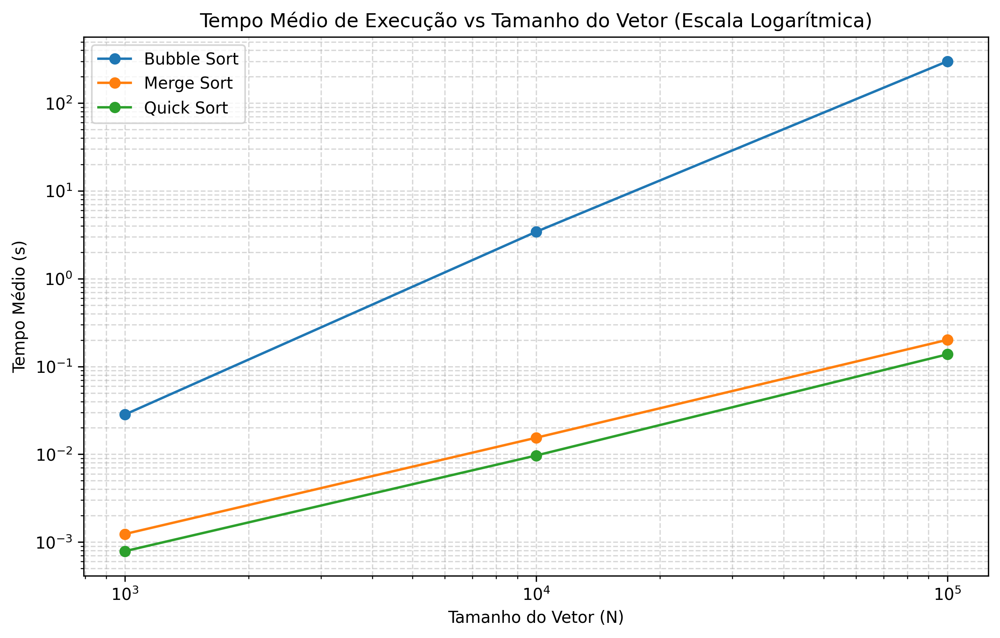

# Lista de Exercícios X - Algoritmos de Ordenação

Este relatório detalha a comparação teórica e experimental entre três algoritmos de ordenação com comportamentos assintóticos distintos: **Bubble Sort**, **Merge Sort** e **Quick Sort**.

---

## 1. Algoritmos Implementados (`ordenacao.py`)

### Bubble Sort
```python
def bubble_sort(arr, max_time=300):
    start = time.perf_counter()
    n = len(arr)
    swaps = 0
    for i in range(n):
        if time.perf_counter() - start > max_time:
            raise TimeoutError()
        swapped = False
        for j in range(0, n - i - 1):
            if arr[j] > arr[j + 1]:
                arr[j], arr[j + 1] = arr[j + 1], arr[j]
                swaps += 1
                swapped = True
        if not swapped:
            break
    return swaps
```

### Merge Sort
```python
def merge_sort(arr):
    movements = 0
    def sort(sub_arr):
        nonlocal movements
        if len(sub_arr) > 1:
            mid = len(sub_arr) // 2
            L = sub_arr[:mid]
            R = sub_arr[mid:]
            movements += len(L) + len(R)
            sort(L)
            sort(R)
            i = j = k = 0
            while i < len(L) and j < len(R):
                if L[i] <= R[j]:
                    sub_arr[k] = L[i]
                    i += 1
                else:
                    sub_arr[k] = R[j]
                    j += 1
                k += 1
                movements += 1
            while i < len(L):
                sub_arr[k] = L[i]
                i += 1
                k += 1
                movements += 1
            while j < len(R):
                sub_arr[k] = R[j]
                j += 1
                k += 1
                movements += 1
    sort(arr)
    return movements
```

### Quick Sort
```python
def quick_sort(arr):
    swaps = 0
    def partition(low, high):
        nonlocal swaps
        pivot_idx = (low + high) // 2
        pivot = arr[pivot_idx]
        arr[pivot_idx], arr[high] = arr[high], arr[pivot_idx]
        swaps += 1
        i = low - 1
        for j in range(low, high):
            if arr[j] <= pivot:
                i += 1
                arr[i], arr[j] = arr[j], arr[i]
                swaps += 1
        arr[i + 1], arr[high] = arr[high], arr[i + 1]
        swaps += 1
        return i + 1

    def sort(low, high):
        if low < high:
            pi = partition(low, high)
            sort(low, pi - 1)
            sort(pi + 1, high)
    sort(0, len(arr) - 1)
    return swaps
```

---

## 2. Análise Teórica de Complexidade

| Algoritmo | Complexidade de Tempo (Pior) | Complexidade de Tempo (Médio) | Complexidade de Tempo (Melhor) | Complexidade de Espaço (Pior) |
| :--- | :--- | :--- | :--- | :--- |
| **Bubble Sort** | $O(n^2)$ | $O(n^2)$ | $O(n)$ | $O(1)$ |
| **Merge Sort** | $O(n \log n)$ | $O(n \log n)$ | $O(n \log n)$ | $O(n)$ |
| **Quick Sort** | $O(n^2)$ | $O(n \log n)$ | $O(n \log n)$ | $O(\log n)$ médio |

### Justificativas

1.  **Bubble Sort**:
    *   No pior caso (lista reversamente ordenada), realiza comparações e trocas em loops aninhados completos, resultando em $O(n^2)$ passos. A nossa otimização com a flag `swapped` permite que, no melhor caso (vetor já ordenado), o algoritmo termine na primeira iteração com complexidade linear $O(n)$.
2.  **Merge Sort**:
    *   Divide o problema em partes iguais recursivamente ($\log n$ níveis de divisão). A intercalação dos subvetores a cada nível exige tempo linear $O(n)$, o que garante um comportamento assintótico constante de $O(n \log n)$ independentemente da disposição inicial dos elementos. O uso de vetores auxiliares exige $O(n)$ de memória física extra.
3.  **Quick Sort**:
    *   No caso médio e melhor caso, divide o vetor de forma equilibrada a cada partição, garantindo $O(n \log n)$. No pior caso teórico (por exemplo, quando o pivô escolhido é sempre o menor ou maior elemento do subvetor), a árvore de recursão degrada para uma lista linear, gerando complexidade de $O(n^2)$.

---

## 3. Resultados Experimentais Obtidos

Os dados brutos coletados nos testes empíricos estão consolidados no arquivo [PlanilhaListaDeExerciciosX.xlsx](PlanilhaListaDeExerciciosX.xlsx) e resumidos a seguir:

### Tabela de Resultados Completa

| Algoritmo | Tamanho | Execução 1 (s) | Execução 2 (s) | Execução 3 (s) | Média (s) | Desvio Padrão (s) | Operações (Trocas/Mov) |
| :--- | ---: | ---: | ---: | ---: | ---: | ---: | ---: |
| Bubble Sort | 1.000 | 0.028183 | 0.028507 | 0.028390 | 0.028360 | 0.000164 | 245.781 |
| Merge Sort | 1.000 | 0.001238 | 0.001234 | 0.001229 | 0.001234 | 0.000004 | 19.952 |
| Quick Sort | 1.000 | 0.000774 | 0.000795 | 0.000791 | 0.000787 | 0.000011 | 6.846 |
| Bubble Sort | 10.000 | 3.309516 | 3.614042 | 3.350260 | 3.424606 | 0.165316 | 24.997.841 |
| Merge Sort | 10.000 | 0.015833 | 0.015552 | 0.014901 | 0.015429 | 0.000478 | 267.232 |
| Quick Sort | 10.000 | 0.009480 | 0.009622 | 0.009937 | 0.009680 | 0.000234 | 83.606 |
| **Bubble Sort** | **100.000** | **Timeout (>300s)** | **Timeout (>300s)** | **Timeout (>300s)** | **Timeout (>300s)** | N/A | N/A |
| Merge Sort | 100.000 | 0.201510 | 0.206034 | 0.196202 | 0.201249 | 0.004921 | 3.337.856 |
| Quick Sort | 100.000 | 0.137558 | 0.141020 | 0.133838 | 0.137472 | 0.003592 | 1.186.666 |

### Análise e Conclusões

1.  **Bubble Sort** confirmou empiricamente sua característica quadrática $O(n^2)$: ao escalar de $1.000$ para $10.000$ elementos ($10\times$), o tempo passou de $\approx0.028$s para $\approx3.42$s ($\approx122\times$ mais lento — próximo ao esperado teórico de $100\times$). Para $100.000$ elementos, o algoritmo excedeu o limite de $5$ minutos e foi interrompido.
2.  **Merge Sort** exibiu comportamento $O(n \log n)$ consistente: ao escalar de $10.000$ para $100.000$ ($10\times$), o tempo escalou $\approx13\times$ (esperado teórico: $\approx11\times$), com desvio padrão baixíssimo, confirmando sua estabilidade em qualquer caso.
3.  **Quick Sort** demonstrou desempenho prático superior, sendo o mais rápido nos três tamanhos testados. A escolha do pivô central ajudou a evitar o caso degenerado, mantendo comportamento médio $O(n \log n)$ e o menor número de operações (trocas) de todos.

---

## 4. Gráfico de Desempenho Visual

O gráfico abaixo utiliza escala logarítmica nos dois eixos para evidenciar as diferenças de crescimento entre os algoritmos, com o Bubble Sort limitado pela barreira de 300 segundos (plotado como valor-limite).


